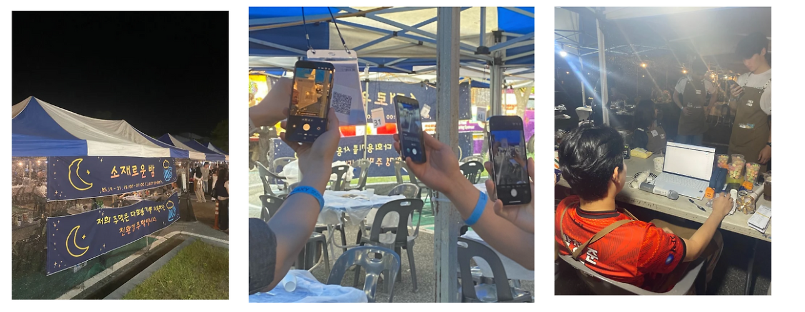
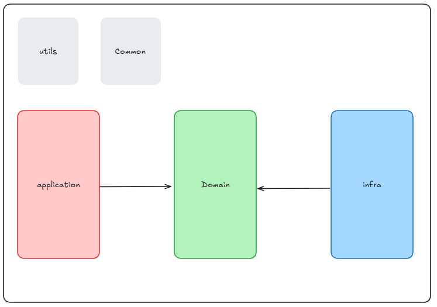
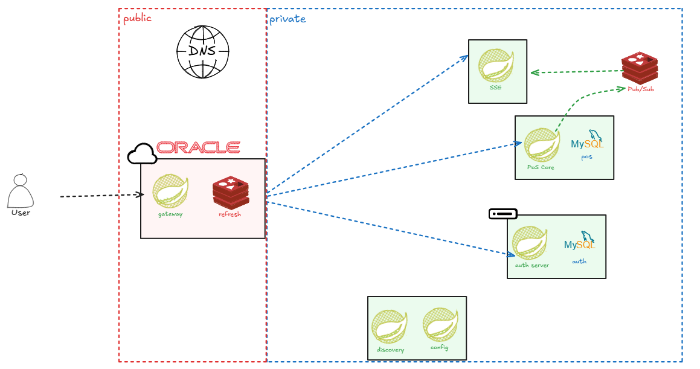

# Project. YABAM

## 🙋 What is YABAM?

> 야밤은 대학 축제 매장을 위한 테이블 오더 & 운영 POS 서비스입니다.
>
> 대학교 축제 특성에 맞는 주문 시스템과 기능 그리고 대학교 점주 분들을 위한 PoS 시스템을 제공합니다.

### 😄 Review

- 야밤 서비스는 금오공과대학교 2025 하계 대동제에서 첫 시범 운영을 했습니다.
- 낮은 사양의 리소스 환경과 높은 신뢰성을 요구하는 실시간 기능을 1000 tps 를 처리하는 서비스를 구축했으며 첫 시범 운영에서 큰 장애 없이 마무리 했습니다.
- 저희 서비스는 더 많은 트래픽과 더 많은 대학교를 지원하는 서비스를 향해 나아갈 것입니다.

## 👪 Team

### Team 구성

- 야밤의 팀은 웹 프론트 팀, 백엔드 팀, 앱 프론트 팀으로 구성되어 있습니다
- 야밤 서비스를 개발하는 모든 팀이 개발자이면서 동시에 도메인 이해 관계자입니다.

### Team Culture

- 야밤은 모든 팀 그리고 팀의 모든 구성원이 같은 도메인을 이해하려 노력합니다.
- 매주 한번씩 도메인에 대한 회의를 진행하고 문서를 수정합니다.
- 야밤의 모든 팀은 도메인에 대한 이해를 바탕으로 개발을 진행합니다.
- 모든 팀이 같은 도메인을 그리고 같은 이해를 위해 공통된 용어집을 사용합니다.
- 도메인 문서 : [야밤 도메인 문서](./docs/도메인_유스케이스.md)
- 도메인 용어집 : [야밤 도메인 용어집](./docs/도메인_용어집.md)

----

## 🌱 YABAM's BACKEND

### 👪 Backend Team

|                                     강민기                                      |                                      김시완                                      |
|:----------------------------------------------------------------------------:|:-----------------------------------------------------------------------------:|
|  |  | 
|                     [@kang20](https://github.com/kang20)                     |                     [@siwan9](https://github.com/siwan9)                      |   

### 🏠 Software 컨벤션과 구조

- 야밤 백엔드 프로젝트는 gradle 의 multi-module 도구와 컨벤션 그리고 린트를 활용하여 코드 품질 그리고 side effect 를 최소화하는 것을 목표로 합니다.
- 다음은 모듈간 의존를 모식화 한 것입니다.
- 자세한 설명은 [야밤 백엔드 개발 가이드](./domain/domain-pos/docs/guide/개발_가이드.md) 를 참고해주세요.

#### 코드 발전 과정 (미작성)

### 🏢 System Architecture

- 야밤의 핵심 서비스는 모놀리식 형태로 구성되어 있습니다(PoS Core)
- 규모가 커짐에 따라 언제든지 확장 가능하도록 멀티 모듈을 사용했으며 해당 구조에 대해 야밤 백엔드 팀은 계속 스터디를 진행합니다.
- Service Mesh 를 이용하여 시스템 운영 환경에서 간단하게 재배포, 확장, 버전업이 가능했습니다.
  

---

## 🐞 Troubleshooting

- [강민기:SSE 도입과 RDB 부하 감소](https://kkangmg.tistory.com/113)
- [강민기:Kafka 에서 Redis Pub/Sub migration](https://kkangmg.tistory.com/115)
