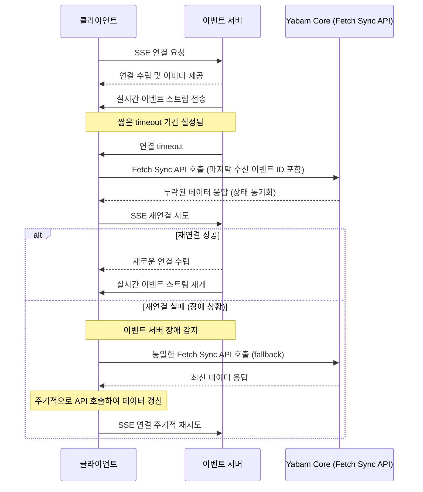
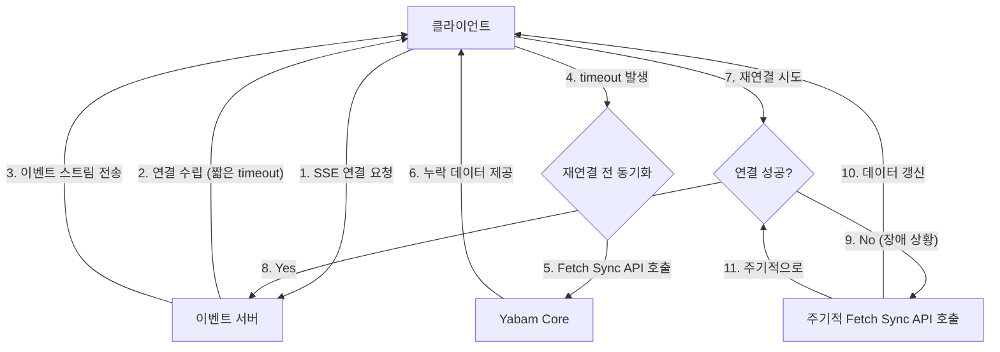
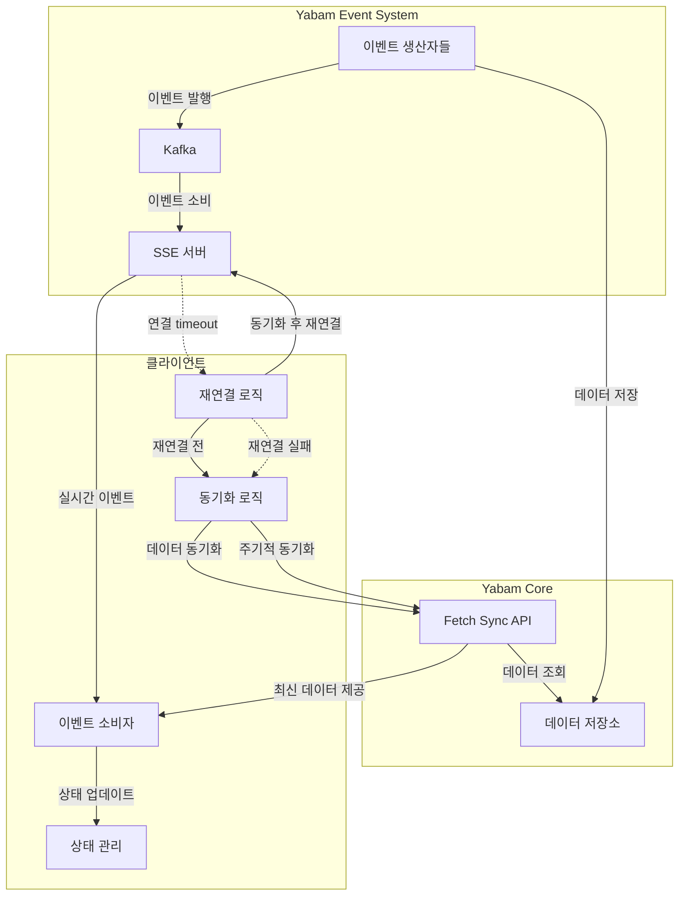
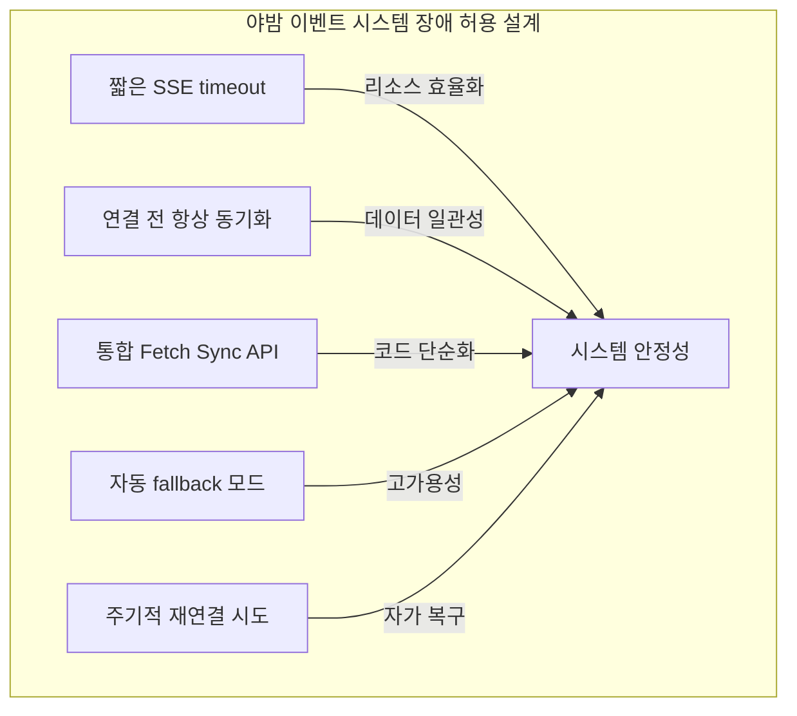

# 야밤 이벤트 시스템 아키텍처 설명서

## 1. 시스템 개요

야밤 이벤트 시스템은 점주와 테이블 간의 실시간 주문 정보를 전달하기 위한 이벤트 기반 아키텍처입니다. Server-Sent Events(SSE) 기술을 활용하여 클라이언트에게 실시간으로 데이터를 푸시합니다.
 점주는 실시간으로(real-time) 데이터를 안정적이고 신뢰성 있게 주문 데이터를 전달 받아야합니다.

일관적인 실시간 데이터 수집을 위해 야밤은 리소스를 최소화하면서 SSE 연결을 유지하고, 장애 발생 시에도 자동으로 복구할 수 있는 아키텍처를 설계했습니다.

## 2. SSE 아키텍처

## 3. Real-Time 지원과 시스템 안정성

### 3.1 재연결 및 동기화 메커니즘

SSE 연결이 timeout 되거나 장애 발생 시 클라이언트는 동일한 Fetch Sync API를 호출하여 데이터를 동기화합니다. 이 API는 일반적인 재연결 상황과 장애 상황 모두에서 fallback 메커니즘으로
작동합니다.

### 3.2 통합된 Fetch Sync API

재연결 시와 장애 상황에서 모두 동일한 API를 사용하는 통합 접근 방식:

## 4. 실시간 시스템과 장애 허용 아키텍처

## 5. 통합 동기화 전략의 이점

### 5.1 단순화된 아키텍처

- **일관된 API**: 재연결 시와 장애 상황에서 모두 동일한 API를 사용하여 코드 복잡성 감소
- **중복 로직 제거**: 동일한 동기화 로직을 재사용하여 코드 유지보수성 향상
- **에러 처리 통합**: 모든 데이터 동기화 상황에서 일관된 에러 처리 방식 적용

### 5.2 강화된 데이터 일관성

- **연결 전 항상 동기화**: 매 연결 시도 전에 동기화를 수행하여 데이터 일관성 보장
- **누락 데이터 방지**: timeout과 재연결 과정에서 발생할 수 있는 데이터 누락 최소화
- **장애 복구 자동화**: 시스템 장애 이후 자동으로 최신 상태로 복구

### 5.3 시스템 안정성 확보

- **우아한 성능 저하**: 이벤트 서버 장애 시 폴링 모드로 자연스럽게 전환
- **리소스 효율화**: 짧은 SSE timeout으로 서버 리소스 관리 최적화
- **중복 요청 방지**: 정확한 lastEventId 추적으로 중복 데이터 요청 방지

### 5.4 사용자 경험 향상

- **끊김 없는 서비스**: 연결 문제나 장애 상황에서도 지속적인 데이터 업데이트
- **백그라운드 복구**: 사용자 인지 없이 자동으로 SSE 연결 복구 시도
- **네트워크 조건 적응**: 불안정한 네트워크 환경에서도 안정적인 서비스 제공

## 6. 설계 원칙 요약

